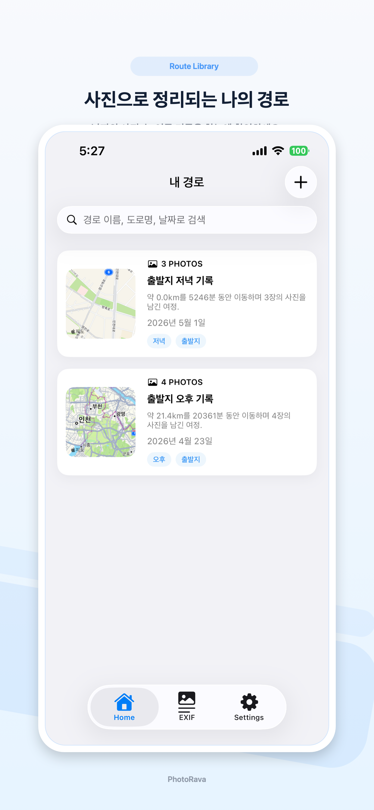
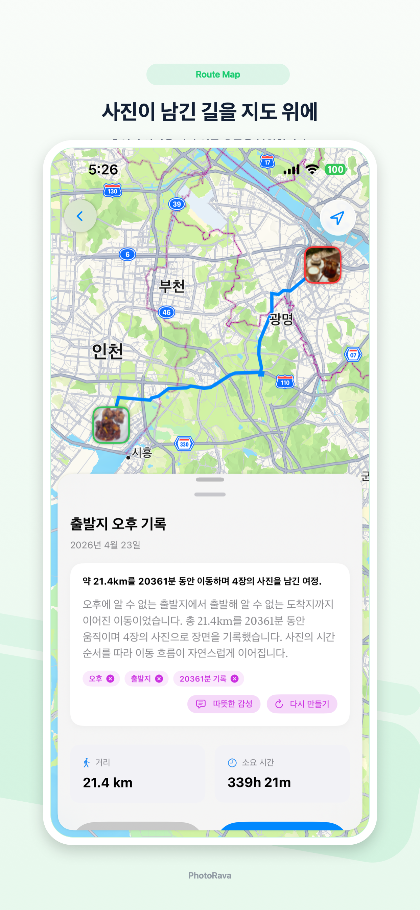
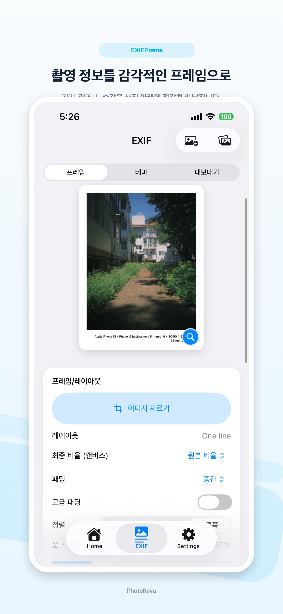
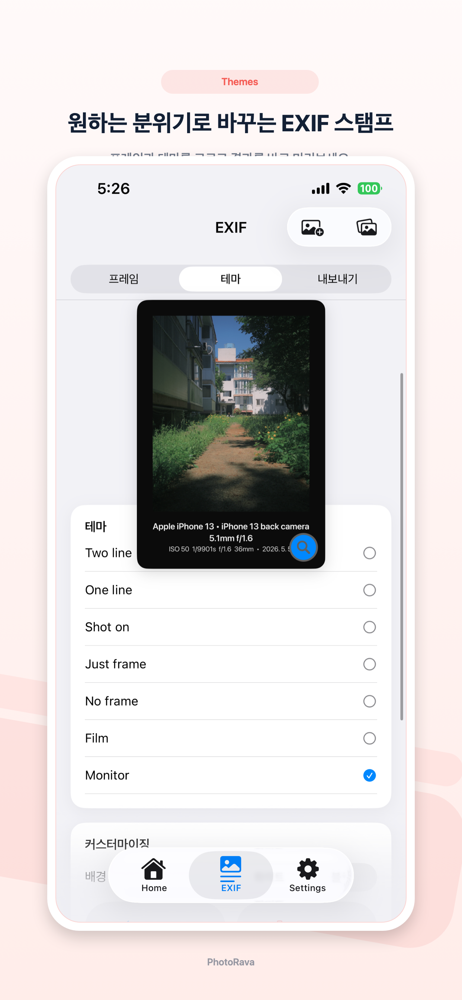
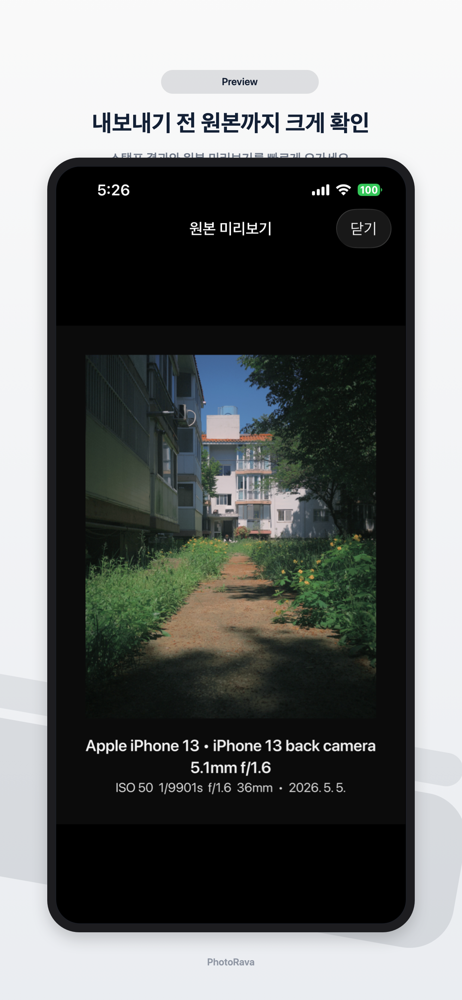

# PhotoRava

PhotoRava is a SwiftUI iOS app that turns photo metadata into a travel route and exports clean EXIF-stamped images. It is built as a single app target with SwiftData persistence, Photos/Vision metadata extraction, MapKit route visualization, and optional on-device AI fallback paths for devices that support FoundationModels.


## Product Snapshot

| Route Library | Route Map | Timeline |
| --- | --- | --- |
|  |  |  |

| EXIF Frame | EXIF Themes | Original Preview |
| --- | --- | --- |
|  |  |  |

## What It Demonstrates

- End-to-end iOS product work: photo selection, route reconstruction, timeline/map review, editing, and export.
- Practical privacy posture: photo/location permissions are explicit, local-first, and documented in `privacy-policy.md`.
- Resilient feature design: AI-assisted geocoding and summaries are optional, with fallback behavior for unsupported devices.
- Recruiter-friendly code organization: feature views, domain models, services, and public docs are separated enough to review quickly.

## Core Features

- **Route reconstruction**: reads GPS metadata from selected photos and derives route distance, time range, locations, and map coordinates.
- **OCR-assisted location recovery**: runs Vision text recognition for photos without GPS and scores likely Korean road-name candidates.
- **Map and timeline review**: presents the reconstructed path through a route map, bottom sheet, and chronological detail view.
- **EXIF stamp export**: renders camera/device/date/location metadata into shareable image frames with preview and batch export support.
- **Settings diagnostics**: exposes permission and Info.plist checks so privacy regressions are visible in the app.

## Technical Highlights

- `SwiftUI` app shell with `SwiftData` models for `Route` and `PhotoRecord`.
- Service-oriented processing for metadata extraction, OCR, route reconstruction, snapshot rendering, and EXIF rendering.
- `@available(iOS 26.0, *)` guards around FoundationModels usage, keeping the app path usable when AI is unavailable.
- Tuist project manifest committed as `Project.swift` so a fresh clone can generate the Xcode project reproducibly.
- Public support/privacy pages and marketing screenshots live in the repository for external review.

## Quick Start

Prerequisites:

- Xcode with iOS SDK support for the imported frameworks.
- Tuist 4.x (`tuist version` in this workspace was verified with 4.31.0).
- `Tuist/Config.swift` is included so worktree checkouts can be detected as Tuist roots.

Generate and open the project:

```sh
tuist generate
open PhotoRava.xcworkspace
```

Build from the command line:

```sh
tuist generate
xcodebuild -workspace PhotoRava.xcworkspace \
  -scheme PhotoRava \
  -sdk iphonesimulator \
  -destination 'generic/platform=iOS Simulator' \
  -derivedDataPath /tmp/PhotoRava-build \
  CODE_SIGNING_ALLOWED=NO \
  build
```

When testing route analysis or EXIF export, allow photo read/write and location permissions.

## Directory Guide

- `Project.swift`: Tuist manifest for the iOS app target.
- `Tuist/Config.swift`: minimal Tuist root configuration.
- `PhotoRava/PhotoRava/PhotoRavaApp.swift`, `AppState.swift`: app entry point and shared UI state.
- `PhotoRava/PhotoRava/Models`: SwiftData models and EXIF settings.
- `PhotoRava/PhotoRava/Views`: feature entry points and UI flows.
- `PhotoRava/PhotoRava/Services`: metadata extraction, OCR, route reconstruction, and image rendering.
- `marketing-screenshots`: app-store-style screenshots and the local generator script.
- `docs/architecture.md`: module map and data flow.
- `docs/workflows.md`: build, verification, and release workflow notes.
- `docs/reviewer-guide.md`: short code-review path for recruiters and external reviewers.

## Public Docs

- [Privacy Policy](PhotoRava/PhotoRava/privacy-policy.md)
- [Support](PhotoRava/PhotoRava/support.md)
